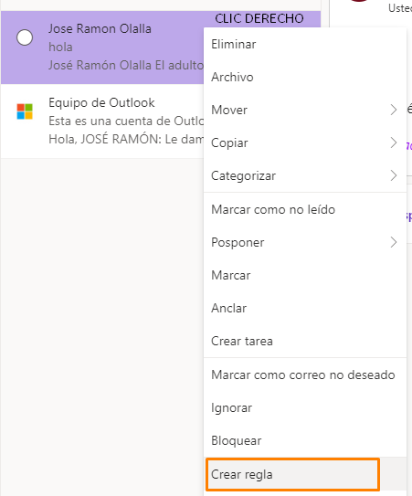
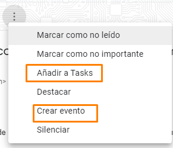
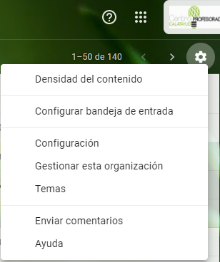

## Unidad 1\. Optimizar el correo electrónico {#unidad-1-optimizar-el-correo-electr-nico}

Aunque cada cual utiliza un servidor de correo diferente, vamos a tratar algunas cuestiones generales que iremos ejemplificando con los dos servicios más habituales: Gmail (G) y Hotmail (H) y adaptar nuestras propuestas a las situaciones que pueden darse en estos días críticos donde el trabajo educativo a distancia es nuestra ocupación y preocupación.

### 1\. Define bien el asunto {#1-define-bien-el-asunto}

Curso o ¿Quieres aprender a chatear en diez pasos?Si lees estos dos asuntos en tu bandeja de entrada ¿cuál leerías primero? Redactar el asunto de un mensaje de forma adecuada puede ser clave para que se lea de inmediato o se olvide entre los demás mensajes. He aquí algunas claves para redactar un asunto atractivo:

<iframe frameborder="0" width="929px" height="677px" style="position: absolute; top: 0; left: 0; width: 100%; height: 100%;" src="https://view.genial.ly/5e71bb56c661be7eee491fe8" type="text/html" allowscriptaccess="always" allowfullscreen="true" scrolling="yes" allownetworking="all"></iframe> 
 
 

### 2.      Cuantas menos cuentas, mejor, pero una sola cuenta es poco. {#2-cuantas-menos-cuentas-mejor-pero-una-sola-cuenta-es-poco}

La mayoría tenemos varias cuentas de correo y algunos de nuestros contactos (colegas, familias, en este caso) pueden tener una, otros otra… Es importante unificarlas para que la comunicación sea óptima:

a.       Dejar la cuenta personal para nuestros mensajes personales y utilizar (si la tenemos) o crear una cuenta profesional que pasaremos a compañeros y familiares.

b.      Si lo tenemos todo mezclado, enviar un mensaje a nuestros contactos profesionales pidiéndoles que usen la cuenta que les indicamos.

c.       Si el flujo de correo con las familias es muy elevado (una maestra de inglés me decía ayer que tiene 6 grupos de 25 niños cada uno a mensaje diario, como mínimo), merece la pena dedicar una cuenta de correo exclusivamente para ese menester.

### 3.       Mantén limpia la bandeja de entrada {#3-mant-n-limpia-la-bandeja-de-entrada}

Una bandeja de entrada limpia, nos permitirá trabajar con mayor fluidez. Archivar en carpetas (G) o en etiquetas (H) los correos una vez contestados es fundamental.

En Hotmail puedes hacerlo desde Crear carpeta, a la izquierda de la pantalla y crear carpetas  y subcarpetas  con la estructura que quieras.

Posteriormente, un clic derecho sobre el mensaje, permitirá mover el archivo a la carpeta deseada.

En Gmail, las carpetas o subcarpetas se llaman etiquetas y podemos crearlas previamente o hacerlo desde el propio mensaje si no están creadas ya sea usando las herramientas o haciendo clic derecho en la lista de mensajes.

A la hora de crear etiquetas, también existe la posibilidad de anidarlas en otras (subcarpetas).

### 4\. Filtra {#4-filtra}

Desde cualquier correo podemos establecer un **filtro**, eso nos ayudará a organizar los correos entrantes directamente en sus carpetas. Cuando recibamos un correo del alumno x, de primero, podemos establecer un filtro de esta manera:

IMÁGENES EN GMAIL

Así todos los mensajes que se vayan recibiendo de ese alumno se almacenarán directamente en la carpeta o etiqueta correspondiente. Eso sí, tendremos que revisar esas carpetas para ver qué mensajes hemos recibido.

IMÁGENES EN HOTMAIL

### 5\. Etiqueta a tus contactos (grupos) {#5-etiqueta-a-tus-contactos-grupos}

Crear grupos de contactos te facilitará enviar correos colectivos a todo el profesorado del centro, al equipo directivo, docente o departamento, a las familias de primero…

En Gmail tendrás que acceder a la aplicación contactos desde el gestor de aplicaciones y crear una nueva etiqueta.

Una vez creada, seleccionar los contactos a etiquetar (1) y asignarlos a la etiqueta (2). O bien, seleccionarlos primero (1) y crear etiqueta después (3).

En Hotmail tendremos que ir a aplicaciones/todas las aplicaciones y seleccionar personas (1).

Una vez elegidas, seleccionaremos agregar a la lista y Nueva lista de contactos o una ya existente (2).

En ambos casos, al enviar el correo colectivo, y siempre desde el campo CCO, elegiremos el grupo destinatario.

HOTMAIL

GMAIL

### 6\. Protege la privacidad {#6-protege-la-privacidad}

En los correos colectivos, usa siempre el campo **CCO** para incluir a las personas destinatarias, ninguna familia tiene que enterarse del correo de otra a través de ti.

### 7\. Cuidado con las cadenas o hilos {#7-cuidado-con-las-cadenas-o-hilos}

Las familias o alumnado no tienen, necesariamente, experiencia en el manejo del correo. Procura huir de los hilos o cadenas de mensajes largos, es preferible crear un nuevo mensaje que reutilizar otro anterior para responder.

### 8\. Organízate {#8-organ-zate}

Recientemente, Gmail ha incorporado a su servicio de correo algunas herramientas que pueden serte muy útiles. Aparecen en el lado derecho y se trata de Google Task, Calendar y Keep.

Desde el menú más, que acompaña a cualquier correo, es posible convertirlo en una tarea (Task) o un evento (calendar). De forma que podemos añadirle una fecha u hora de resolución o, simplemente dejarlo como tarea pendiente.

Algo parecido podemos hacer con Hotmail y su crear tarea.

No vamos a insistir mucho más en ello, pues ni Calendar ni Task son objeto de este curso que pretende ser rápido.

### 9\. Configura {#9-configura}

*   Ajusta la densidad del contenido que más se adapte a tus gustos.

*   Si Configuras la bandeja de entrada con pestañas, recuerda que Gmail clasificará automáticamente los correos entrantes y tendrás que visitar todas las pestañas, no sólo la de entrada.

*   Revisa la configuración, donde podrás organizar tus etiquetas, establecer firmas (con despedidas estandarizadas), redireccionar otras cuentas…

En hotmail ésta puede ser la configuración ideal, aunque dependerá de tus gustos:

### 10 Marca como Spam

Si un correo no deseado te visita regularmente, es mejor que lo marques como spam (correo no deseado)., ganarás tiempo.

Bloquea a los remitentes no deseados.

