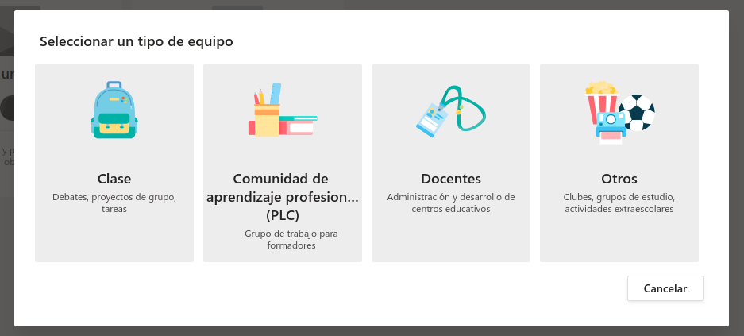

## Teams: Creación de un equipo {#teams-creaci-n-de-un-equipo}

En Teams todo se organiza en torno a equipos, por lo que lo primero que necesitaremos es, bien **unirnos a un equipo que ya exista, o bien crear uno nuevo**.

Para crear un equipo nuevo, lo haremos desde la opción Equipos del menú de la izquierda y elegiremos entre los siguientes tipos de equipos:

*   **Clase**: es el único que distingue roles de alumnado y profesorado. Permite entrega de tareas.
*   **Comunidad de aprendizaje profesional**: dirigido sólo a profesorado con el objetivo de compartir recursos y crear grupos de trabajo.
*  ** Docentes**: también para profesorado, normalmente para temas de organización de centro.
*   **Otros**: sin formato preestablecido para poder adaptarlo a distintas circunstancias.

Los equipos pueden ser públicos o privados. Además también es posible crear un nuevo equipo tomando otro ya existente como plantilla.

Una vez creado el equipo, será necesario **añadir a sus miembros**. Ésto puede hacerse bien en el mismo momento de creación del equipo, o a posteriori, desde la página del equipo, a la que accedemos haciendo click sobre el nombre del mismo.

Igualmente es posible, que **sea el usuario quien solicite pertenecer a un equipo**. Para ello el creador o administrador del equipo, desde la opción Configuración de la ficha del equipo, habilitará el **código del grupo**, que es el que se deberá indicar a la hora de solicitar unirse a un equipo. En este caso, deberán ser aceptadas estas solicitudes por el creador o administrador del equipo.

https://youtu.be/STCriwxe8uM 