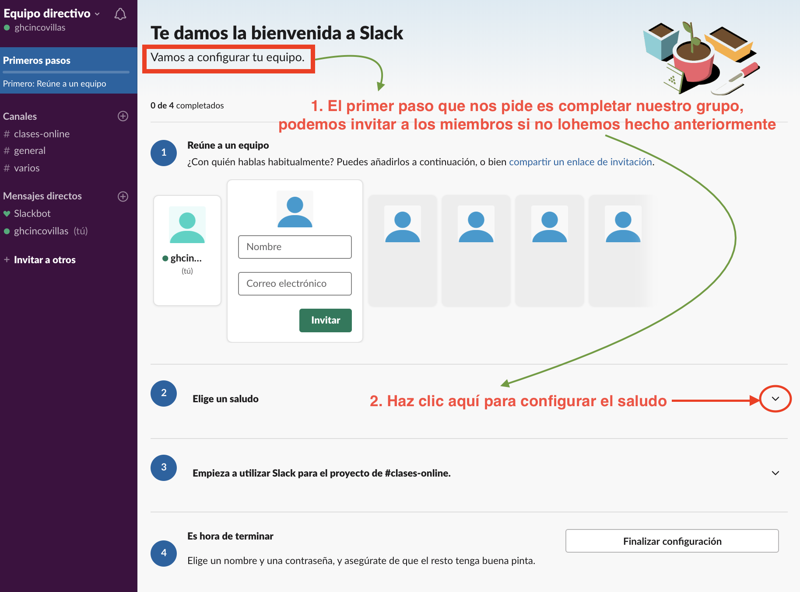
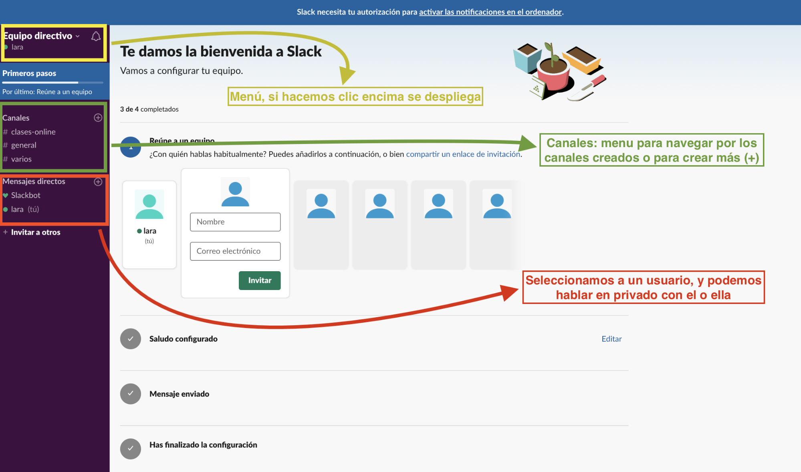
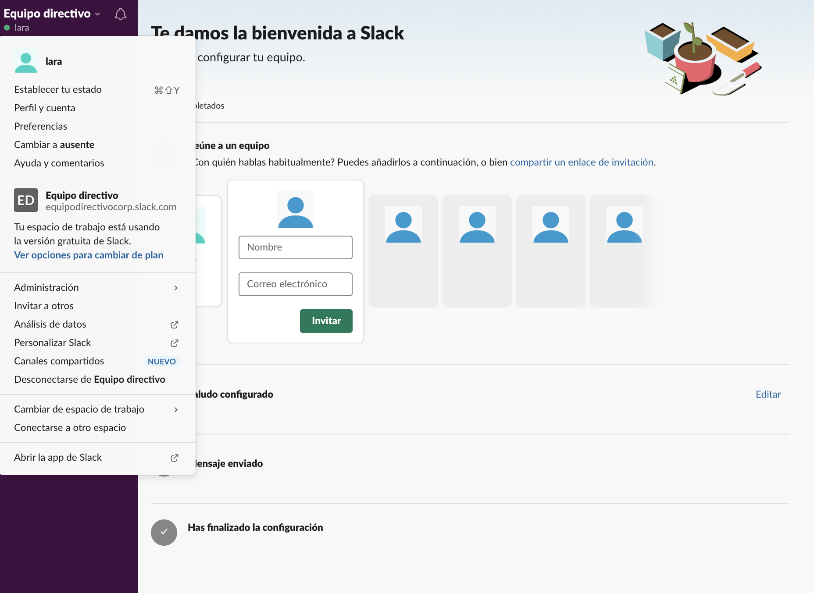
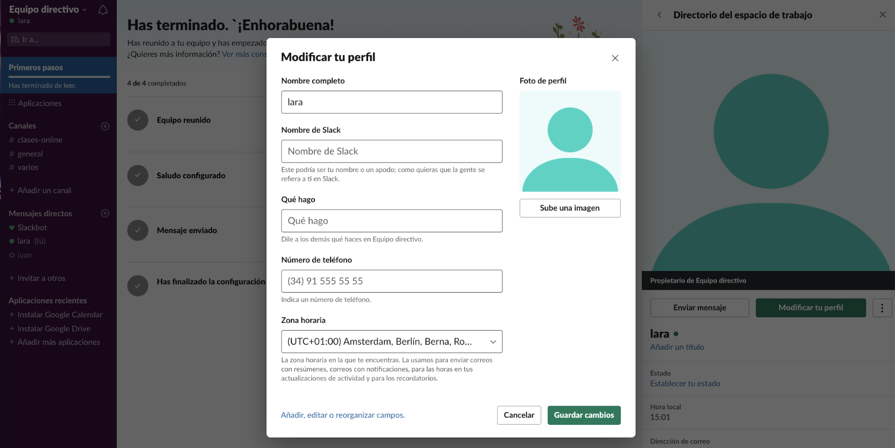
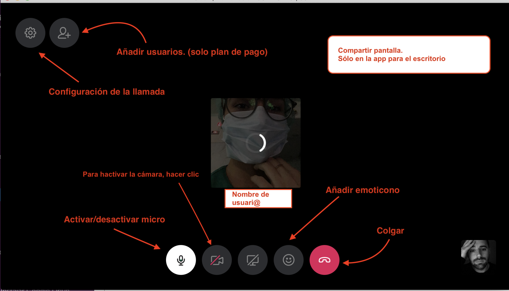

#
# Unidad 1\. Slack. {#unidad-1-slack}

### Capítulo 0\. Presentación. {#cap-tulo-0-presentaci-n}

**¿Qué es Slack?**

[Slack](https://www.google.com/url?q=https://slack.com/intl/es-es/&sa=D&ust=1584707445709000) es una herramienta freemiun de colaboración que puede ayudar a que tu equipo y tú podáis trabajar de forma coordinada más fácilmente. Existen varias versiones, además de la versión web existe: una aplicación para el escritorio (Windows / Mac) y la versión móvil ([Android](https://www.google.com/url?q=https://slack.com/intl/es-es/downloads/android&sa=D&ust=1584707445709000) / IOS)

**Tu espacio de trabajo de Slack**

En Slack podrás trabajar en uno o varios espacios de trabajos. Cada espacio de trabajo está formado por canales (cada canal puede ser un tema de trabajo o un subgrupo de trabajo), donde los miembros del equipo se comunican y trabajan juntos. Esta herramienta permite:

* **Realizar conversaciones organizadas**:

En Slack, los miembros del equipo envían mensajes y comparten archivos en canales. Crea canales para equipos, proyectos, oficinas o cualquier otro aspecto que sea relevante para tu organización. Puedes hacer que los canales sean cerrados para mantener conversaciones privadas a las que no deberían acceder todos los miembros, o puedes usar canales compartidos para colaborar con una organización diferente a la tuya.

Puedes crear canales con Grupos, niveles educativos, departamentos didácticos, comisiones, tutores de un nivel, uno para todo el claustro, etc. De esta forma puedes reproducir la estructura de la organización de tu centro.

* **El Historial y sus beneficios**

Cuando el flujo de trabajo es intenso y se comparten muchos mensajes y archivos, a veces puede ser difícil encontrar un archivo o conversaciones. A través del “Historial de conversaciones” que se genera en tu equipo en Slack podrás encontrar archivos y mensajes relevantes.

* **Conectar aplicaciones**

Puedes añadir a tu espacio de trabajo algunas aplicaciones de terceros o herramientas que quizá ya utilizas.

### Capítulo 1\. Empezando con Slack {#cap-tulo-1-empezando-con-slack}

#### 1.1\. Cómo crear una cuenta en Slack {#1-1-c-mo-crear-una-cuenta-en-slack}

La forma en la que te unas a Slack dependerá de si eres el encargado de generar el espacio de trabajo y por lo tanto su propietario, o si el espacio de trabajo ya está creado y accedes como un invitado más del grupo de trabajo. Para saber los permisos que puede tener cada miembro, es necesario conocer los roles existentes:

**Roles administrativos**

* **El propietario principal de un espacio de trabajo**: Cada espacio de trabajo tiene un único propietario y éste ostenta el grado más elevado de permisos. Esta persona es la única que puede eliminar el espacio de trabajo o transferir la propiedad a otro miembro.
* **Los propietarios de un espacio de trabajo**: El propietario principal puede designar otros propietarios del espacio de trabajo.Éstos tienen el mismo nivel de permisos que el propietario principal, pero no pueden eliminar un espacio de trabajo ni transferir la propiedad del mismo a un tercero.
* **Los administradores de un espacio de trabajo**: Cada espacio puede estar compuesto por varios administradores. Éstos pueden ayudar a gestionar miembros y canales, además de realizar otras tareas administrativas.

**Roles no administrativos**

* **Los miembros de un grupo**: Son las personas que se unen a tu espacio de trabajo de Slack. Pueden utilizar Slack para comunicarse y colaborar con otros miembros.
* **Los invitados**: Son las personas que se unen a tu espacio de trabajo, pero tienen un acceso limitado al mismo. Podemos diferenciar dos tipos de invitados:
* Los invitados llamados **monocanal** se unen a un espacio de trabajo por invitación y pueden acceder a un canal específico.
* Los invitados **multicanal** en cambio se unen a un espacio de trabajo, también por invitación, pero pueden acceder a uno o más canales.

Una vez tengamos claro los roles, vamos a proceder a crear una cuenta en Slack.

#### 1.2\. Crear cuenta de Slack (propietario) {#1-2-crear-cuenta-de-slack-propietario}

Lo primero debemos ir a la página web de la aplicación (Slack) y iniciar el proceso de registro siguiendo los siguientes pasos.

**a) Registro con correo. **

El primer paso que debemos dar es registrarnos en la plataforma, para ello vamos a [Slack](https://www.google.com/url?q=https://slack.com/intl/es-es/&sa=D&ust=1584707445712000) y hacemos clic en “Primeros Pasos” o el botón de “Prueba Slack”, los dos nos conducirán a otra pantalla, donde nos plantea dos opciones. La primera, si mi equipo ya está en Slack, elegiremos la primera opción. De lo contrario, elegimos la segunda opción, para crear la cuenta y el equipo desde cero. Después de darle a confirmar, nos Slack nos enviará un código de 6 números al correo que hayamos dado. Vamos al correo, copiamos los números, los pegamos en la web de Slack y seguimos el proceso de creación de la cuenta.

b) **Nombre del equipo de trabajo y del proyecto**.

Todavía tenemos ni cuenta ni espacio ni grupo alguno en Slack, por eso al elegir esta opción nos envía a una primera página en la que debemos poner el nombre de nuestro equipo (en el que vamos a trabajar todos los miembros del equipo). Le damos a continuar y seguidamente nos lleva a una pantalla para que especifiquemos el nombre del proyecto en el que estamos trabajando (se pueden crear más adelante nuevos proyectos, por el momento, para aprender crearemos solamente uno)

c) **Invitación al espacio de trabajo de otros miembros del grupo de trabajo**.

En este apartado podemos invitar a tantas personas como queramos, siempre que tengamos su correo electrónico. Si no tenemos sus correos en ese momento o bien preferimos invitarlos mediante un correo desde nuestra cuenta, hacemos clic sobre el enunciado “Obtener un enlace de invitación para compartir” y, automáticamente, se copiará el enlace en nuestro portapapeles, vamos a nuestro correo, pegamos la dirección y se la enviamos a los miembros de grupo (normalmente, multicanal).

Si lo preferimos, podemos omitir este paso para hacerlo más adelante.

Imagen 4\. Envío de invitaciones a miembros. Elaboración propia.

Seguidamente, ya tenemos todo configurado y nos enviará a una pantalla en la que nos invitará a abrir nuestro canal de Slack, hacemos clic en el botón de “abrir canal de Slack” y accederemos a nuestro espacio de trabajo.

##### 1.2.1\. Únete a un espacio de Slack (miembro o invitado) {#1-2-1-nete-a-un-espacio-de-slack-miembro-o-invitado}

En este caso, para unirte a un espacio de trabajo de Slack sólo tienes que aceptar la invitación que te han enviado por correo electrónico y crear una cuenta de invitado.

Es posible que si no te llega la invitación a “Recibidos”, tengas que revisar la cuenta de “Spam”. En caso de no recibirla, habla con el propietario del espacio y pídele que te la reenvíe de nuevo, asegurándote de que la dirección ofrecida es la correcta.

Una vez has recibido el correo, entra haz clic en el botón “join now”. Te aparecerá una nueva ventana o pestaña de registro, y ahí tendrás que poner la url del espacio (espacio, por ejemplo.

Nota: ¡Ojo!, hay que eliminar la parte de la url .skack.com, ya que sino no te permite registrarte).

Imagen 5\. Ingreso en Slack por invitación. Elaboración propia.

A partir de aquí, debes realizar un registro muy similar al anterior, aunque algunos de los pasos (como dar nombre al espacio o a grupo) se omiten.

##### 1.2.2\. Los primeros pasos.Configuración y menús. {#1-2-2-los-primeros-pasos-configuraci-n-y-men-s}

**Paso 1\. La configuración del equipo (sólo propietarios)**

Ya estamos registrados y logueados, ahora vamos a completar el perfil del equipo, un aspecto básico siempre que nos demos de alta en una esta plataforma.

1\. Reúne al equipo: Podemos añadir a usuarios, en el caso de que no lo hubiéramos hecho ya. Ponemos el nombre y el correo, y le damos a invitar y le llegará al usuario una invitación para unirse a nuestro espacio de trabajo.

2\. Configurar el saludo: Aquí podemos (o no) cambiar el saludo con el que queremos saludar a nuestro equipo cuando vayan entrando en el espacio de trabajo. También se puede enviar un saludo a los miembros de los distintos canales (véase la diferencia entre espacio de trabajo y canales)

3\. Finalizar configuración: Una vez hemos realizado los pasos anteriores le damos a finalizar la configuración.

Imagen 6\. Primeros pasos. Elaboración propia.

Paso 2\. Conocer el menú.

Es esencial conocer las áreas de trabajo y menú de trabajo para poder utilizar una herramienta. El área de trabajo más relevante la encontramos a la izquierda de nuestra ventana, donde encontramos el acceso al menú en la parte superior, seguido de los canales que tenemos creados (para acceder, hacer clic encima del canal deseado) y del apartado de mensajes directos (doble clic sobre el usuario para mantener un chat en privado y directo)
Imagen 7\. Escritorio de Slack. Elaboración propia.

Una vez conocemos ese área en general, vamos a presentaros de una forma sencilla una de las mismas. Nos referimos a las funciones esenciales que recoge el menú de Slack.

**Menú principal**.

El menú principal se sitúa en la esquina superior izquierda. A simple vista veremos el nombre de nuestro espacio de trabajo, pero si hacemos clic encima del nombre (En nuestro caso Equipo directivo) se desplegará un menú.

Imagen 8\. Menú principal de Slack. Elaboración propia.

Ahora vemos el menú que tenemos que conocer para utilizar de forma óptima esta herramienta. Vamos a ir por pasos y en orden:

#### 1)Establece tu estado: 

En este apartado podremos especificar un estado de perfil. Entre las opciones nos indica, “En una reunión”, “De vacaciones”, etcétera.

Imagen 9\. Establecer tu estado. Elaboración propia.

Si escribimos en el campo superior (donde pone “¿Cuál es tu estado?”) podemos personalizar nuestro mensaje y estado, así como los iconos que lo acompañan.

Si hacemos clic en el enlace “Editar sugerencias para equipo directivo”, nos conduce a una página en la que podemos personalizar los mensajes predefinidos de nuestro grupo, incluso cambiar el periodo de tiempo establecido por el que permanecen activos.

#### 2) Perfil y Cuenta: 

Haciendo clic en este apartado nos aparecerá un menú en la parte derecha de nuestra pantalla. Si hacemos clic en “modificar perfil”, nos aparecerá una pantalla en la que podremos cambiar nuestro nombre; podemos poner el nombre de Slack (será el que aparecerá en nuestro perfil), podemos especificar qué hacemos (nuestro cargo o función); el teléfono, aunque no es obligatorio, y debemos seleccionar nuestra franja horaria de entre el desplegable.

Imagen 10\. Modificar tu perfil (1). Elaboración propia.

En este apartado podremos también cambiar nuestra imagen de perfil. Haz clic en “sube una imagen” y se abrirá una ventana para que la selecciones desde tus archivos de tu ordenador.

Imagen 11\. Modificar tu perfil (2). Elaboración propia.

Imagen 12\. Submenú en el perfil. Elaboración propia.

Si hacemos clic en el menú desplegable (véase imagen 12) que tenemos al lado de “Modificar tu perfil”, veremos un submenú que nos permite: “ver tus preferencias”; acceder a los “Ajustes de la cuenta”; “ver tus archivos”, o cambiar el estado a “ausente”. Por el momento, el submenú que más nos interesa será el de “Ajustes de la cuenta”. Si hacemos clic ahí, se abre una nueva pantalla en la que podemos cambiar nuestros ajustes (contraseñas, franja horaria, dirección de correo) y, si hacemos clic en “notificaciones” (en el menú superior”, podremos configurar qué tipo de notificaciones queremos recibir. En este caso debemos configurarlo de acuerdo a nuestras necesidades.

#### 3) Preferencias. 

Volviendo al menú principal, el tercer apartado nos lleva a configurar las preferencias. En este apartado podremos cambiar muchos aspectos esenciales para el funcionamiento de la aplicación y del aspecto de la misma. En el menú lateral podemos ver que nos permite modificar apartados como:

1. Notificaciones

2. Idioma y región

3. Mensajes y medios

4. Temas

5. Barra lateral

6. Marcar como leído

7. Accesibilidad

8. Avanzados

Imagen 13\. Menú de preferencias. Elaboración propia

**En notificaciones** podremos cambiar el modo en el que recibimos las notificaciones tanto en nuestro escritorio del pc, como en nuestros dispositivos móviles (en el caso de que hayamos descargado la aplicación en nuestro smartphone o tablet). Podemos activar o desactivar las notificaciones que recibimos en el escritorio de nuestro pc. Podremos activar o desactivar las notificaciones en los hilos. Podremos configurar las notificaciones en nuestros dispositivos móviles. En mis palabras clave, podremos establecer algunas palabras clave. Cuando un mensaje contenga una de esas palabras (ejemplo: director) nos aparecerá una notificación.

* **Modo no molestar**: podemos activar o desactivar este modo automático, y elegir el rango de horario que queremos no ser molestados por las notificaciones.
* **Cuando no estoy activo en el ordenador**: En este apartado la aplicación os permite elegir entre varias opciones.
1. “Enviarme notificaciones de correo si me mencionan en Slack o me envían un mensaje directo”
2. “una vez cada 15 minutos”
3. “una vez cada hora”

Elegimos la que mejor se adapte a nuestro ritmo de trabajo.

* **“Idioma y región”**: En este apartado podemos cambiar aspectos relacionados con la franja horaria y el idioma (viene predefinido el inglés, lo deberíamos de cambiar a español)
* **Mensajes y medios**: En esta página podemos cambiar el modo en el que se ven los mensajes y algunas operaciones a la hora del envío de los mismos. Las opciones predefinidas son las más adecuadas para trabajar. Podemos cambiar el tema o la visualización de los nombres de acuerdo a nuestros gustos o necesidades.
* **Temas**: Nos permite cambiar el tema de nuestro Slack, dándonos una serie de opciones, como elegir entre un tema claro u otro oscuro y, seguidamente, podemos cambiar el tema de la barra de herramienta al seleccionar una de las alternativas que se proponen. En la parte inferior de las opciones nos propone “personalizar tu tema”, pudiendo elegir los colores a aplicar en las diferentes partes de la aplicación (para usuarios avanzados)
* **Barra Lateral**: En este apartado podemos elegir qué conversaciones ver en la barra lateral. Por defecto viene todo, pero podemos seleccionar entre varias opciones la que más nos interese.
* **Marcar como leído**: nos propone que personalicemos el momento en el que un mensaje se marcará como leído. Elegir entre las opciones la más adecuada para nuestra forma de trabajar.
* **7 y 8. Accesibilidad y Avanzados**: estos apartados son para usuarios que quieran dar un paso más allá, aprendiendo atajos de teclado y otras operatividades que superan los objetivos de este curso.

#### 4. Cambiar a Ausente / Disponible. 

Es un atajo rápido para cambiar nuestro modo a la hora de estar trabajando en la plataforma.

#### 5. Ayudas y comentarios: 

Apartado de ayuda para los usuarios a resolver dudas (FAQ).

### Capítulo 2. La gestión del espacio de trabajo. 

En primer lugar, hay que señalar que se pueden disponer de más de un espacio de trabajo y desde la misma cuenta de Slack se pueden gestionar ambos. Antes hemos visto cómo crear un espacio de trabajo. También hemos visto cómo ingresar en un grupo como miembro o invitado. Ahora vamos a ver cómo podemos conectarnos a más de un espacio de trabajo.

#### 2.1. Conectarse a otro espacio de trabajo. 

Para conectarse a otro espacio, en el caso de que lo haya creado otra persona, sólo necesitamos una invitación por parte del propietario del nuevo espacio de trabajo (que nos llegará al correo electrónico). Hacemos clic en el botón que viene en el correo (“join...”) y nos pedirá que nos logueamos con nuestra cuenta de Slack (correo electrónico + contraseña).

Seguidamente, nuestra cuenta estará conectada a ese otro espacio de trabajo. Desde el menú principal, podremos cambiar de espacio de trabajo fácilmente. En las siguientes imágenes se explica cómo cambiar de grupo en tres casos concretos:

**Opción 1. Cambiar la cuenta desde el navegador**.

Imagen 14. Cambiar de espacio desde la aplicación de navegador. Elaboración propia

**Opción 2. Cambiar de cuenta desde la aplicación de escritorio**.

Imagen 15. Cambiar de espacio desde la aplicación de escritorio. Elaboración propia.

**Opción 3. Cambiar de cuenta desde la aplicación de móvil**.

Imagen 16. Cambiar de espacio desde la aplicación de movil. Elaboración propia.

#### 2.2. La administración de un espacio de trabajo 

Cuando accedemos al área de administración del espacio del trabajo, accederemos a una página de configuración que tiene cuatro pestañas de gestión en la parte superior (“Ajustes”, “Permisos”, “Autentificación” y “Adjuntos”) que nos lleva a cuatro configuraciones diferentes.

Imagen 17. Administración. Elaboración propia.

##### 2.2.1. Ajustes 

En este apartado podemos cambiar la configuración de algunos parámetros importantes. Los más destacados son:

* **Canales predeterminados**: Son los canales en le aparecerán de forma predeterminada a los miembros del grupo se van a ver registrar. Ellos formarán parte de esos grupos de forma automática. El canal general está predefinido, pero si queremos que todos participen en un otro canal debemos seguir estos pasos. Primero crear el canal. Segundo, venir a este apartado y seleccionarlo de entre la lista en el desplegable, y hacemos clic en guardar.
* **Nombre y Correo**: Podremos configurar el nombre con el que deseamos aparecer. También podremos permitir o no que los usuarios puedan ver nuestro correo electrónico.
*** Icono de espacio de trabajo**: En esta sección podemos cambiar el icono del espacio del trabajo. Sólo necesitamos expandir este apartado, y hacer clic en el botón “seleccionar icono”. Se abrirá nuestro explorador de archivos. Seleccionamos la imagen. Seguidamente, le damos al botón “subir icono”. Seguidamente aparecerá nuestra nueva imagen de grupo.

Imagen 18. Sección de Ajuste. Elaboración propia.

##### 2.2.2. Permisos {#2-2-2-permisos}

En este apartado podemos gestionar diferentes permisos. En la versión gratuita los permisos a gestionar son menores que los que permite una cuenta premium. Estas son algunas de las funciones que podemos cambiar a nuestro gusto en Slack:

* **Mensajería**: Establecer quién puede usar @todos y @canal.
* **Invitaciones**: Por defecto, cualquier miembro puede invitar a otros a tu espacio de trabajo. Si quieres, puedes hacer que para enviar invitaciones sea necesaria la autorización de un administrador.
* **Gestión de canales**: Elige quién puede crear y archivar canales, gestionar permisos de publicación y eliminar a miembros de los canales.
* El resto de las opciones, se recomienda dejarlas tal cual vienen predefinidas.

##### 2.2.3. Autentificación. 

Sólo permite establecer cambios en los ajustes a los usuarios premiun.

##### 2.2.4. Adjuntos {#2-2-4-adjuntos}

Es un apartado meramente informativo.

### Capítulo 3. La comunicación a través de Slack {#cap-tulo-3-la-comunicaci-n-a-trav-s-de-slack}

#### 3.1. Los canales {#3-1-los-canales}

##### 3.1.1. ¿Qué es un canal? {#3-1-1-qu-es-un-canal}

Hay muchas aplicaciones que utilizan canales para facilitar y favorecer la comunicación. Twitter, por ejemplo, es una red social que permite la creación de miles de canales, sólo hace falta incluir en el mensaje un Hashtag (que en sí, es un canal de comunicación). En Slack, el trabajo y la comunicación transcurren en canales.

Un canal es un espacio donde los equipos comparten mensajes y archivos. Es necesario hacer un buen planteamiento inicial de cuántos canales se necesitan y qué temática o par a qué función de va a utilizar cada uno (de esta forma podremos decidir qué miembros deberían participar en unos u otros)

##### 3.1.2. Cómo crear un canal {#3-1-2-c-mo-crear-un-canal}

Ya seas propietario o uno de los miembros, puedes crear un canal. Crear un canal es muy sencillo, en la barra de herramientas lateral, al lado de la sección “Canales” observaras un (+). Haz clic en el (+), te aparecerá una ventana en la que deberás de especificar el nombre del canal, una descripción (si así lo deseas) y puedes elegir entre crear un canal público o privado..

Imagen 19\. Crear un canal nuevo. Elaboración propia

##### 3.1.3. Cómo puedo añadir personas a un canal específico {#3-1-3-c-mo-puedo-a-adir-personas-a-un-canal-espec-fico}

Los miembros del equipo pueden añadir personas a los canales de formas muy diversas. La más sencilla es ir al canal, y hacer clic donde se especifica la posibilidad de “anadir gente”. Seguidamente aparece una ventana emergente donde en el único campo que aparece escribimos el correo electrónico (pueden ser más de uno, siempre separados por comas) y le damos al botón de “añadir”.

Imagen 20. Añadir personas a un canal. Elaboración propia

##### 3.1.4. Cómo convertir un canal en abierto o cerrado {#3-1-4-c-mo-convertir-un-canal-en-abierto-o-cerrado}

Los canales pueden ser abiertos, cualquier usuario puede participar en la conversación y verlas, o privados, sólo los miembros de ese canal pueden intercambiar mensajes. Para convertir un canal en privado, es muy sencillo. Acudimos a la ruleta de configuración, existente en el propio canal. En el menú que se despliega elegimos “Más opciones”, y entre las posibilidades que nos aparecen (desde cambiar nombre del canal hasta eliminarlo) elegimos “cambiar a un canal cerrado” y hacemos luego clic en el botón “convertir a canal cerrado” y confirmamos en la ventana emergente que aparece después. Seguidamente, el canal aparecerá con un candado en la barra lateral, en la sección “canales”.

**Nota**: por cuestiones de privacidad un canal privado no podrá modificarse para que sea público.

Imagen 21. Convertir un canal en privado. Elaboración propia

##### 3.1.5. Cómo eliminar a un miembro del canal {#3-1-5-c-mo-eliminar-a-un-miembro-del-canal}

Slack también nos permite eliminar a un miembro de un canal fácilmente. Eso sí, las personas que pueden eliminar a miembros dependerá de si poseen los permisos de gestión de canales necesarios. Éstos los define el propietario del espacio de trabajo.

Para proceder de forma rápida a esa eliminación, puedes seguir uno de estos dos métodos:

* **Método 1**. Para ello debes escribir /eliminar @miembro en el campo de entrada de mensajes de un canal. Luego pulsa Intro o haz clic en Enviar. Haz clic en Sí, elimínalo.
* **Método 2**: Justo debajo del nombre del canal, debes hacer clic en el icono “Ver lista de miembros”. Aparece una lista en la barra lateral derecha. Busca la persona que deseas eliminar. Haz clic en su nombre y selecciona “Eliminar de #nombredelcanal”. Haz clic en Sí, para conformar su eliminación. El bot de Slack informará al usuario de que ha sido eliminado.

##### 3.1.6. Para qué sirve el canal general {#3-1-6-para-qu-sirve-el-canal-general}

El canal general aparece en nuestras cuentas de forma predeterminada. Es un espacio público donde tienen cabida todos los miembros que trabajan en el espacio creado en Slack. Su uso es con carácter general, para mantener un canal de conversación que no sea de un tema específico. Un ágora virtual abierta a todos los miembros. En la organización de un centro educativo, sería un canal donde estaría tidi el claustro e incluso, si así se les incluye en esta coordinación, el personal auxiliar y de servicios.

##### 3.1.7. El uso de los canales. Recomendaciones. {#3-1-7-el-uso-de-los-canales-recomendaciones}

* **Evita los canales privados**, la transparencia debería ser una práctica habitual en nuestras instituciones.
* **Realiza un mantenimiento del espacio**. Si eres el propietario del mismo, archiva los canales que ya no se utilicen (su historial y archivos de guardarán y se podrán consultar por sus miembros). Si optas por eliminar los canales que no se usan, ten presente que la información y archivos se perderán.
* **Cada canal debe ir ligado a un tema concreto o a una finalidad**. Para hablar de cuestiones generales ya está el canal general.

#### 3.2. Los mensajes {#3-2-los-mensajes}

##### 3.2.1. Enviar y leer mensajes {#3-2-1-enviar-y-leer-mensajes}

Para enviar un mensaje, sólo tenemos que ir al campo de texto en laparte inferior de nuestra área de trabajo. Escribimos un mensaje y le damos a enviar. Podemos enviar diferentes tipos de mensajes: sólo de texto, texto con imágenes o archivos adjuntos.

Para editar los mensajes disponemos en la parte inferior del campo de escritura una serie de herramientas para modificar el estilo del mensaje (negrita, cursiva, subrayado); tenemos la herramienta para incluir un enlace, o las herramientas de alineado del texto, Lista numerada o Lista con viñetas.

Para mencionar a un usuario tenemos que incluir el (@), o bien escribir su nombre de usuario o seleccionarlo de entre los miembros que nos aparecerán en una lista desplegable en cuanto pongamos la arroba en el campo de escritura (de esta forma le llegará una notificación directa)

Imagen 22 A. Crear un hilo. Elaboración propia.

##### 3.2.2. Qué son los hilos y que utilidad tienen {#3-2-2-qu-son-los-hilos-y-que-utilidad-tienen}

Los hilos de los mensajes te ayudan a mantener las conversaciones organizadas y centradas en un tema dentro de los canales. Son muy útiles para evitar sobresaturar el canal con mensajes.

Imagen 22 B. Crear un hilo. Elaboración propia.

##### 3.2.3. Compartir mensajes en Slack {#3-2-3-compartir-mensajes-en-slack}

Compartir mensajes en Slack es una tarea sencilla. Sólo debemos hacer clic encima del mensaje. Aparecerá a la derecha un menú secundario. Seleccionamos el icono de la flecha (⇨) para proceder al reenvío. Podemos compartir el mensaje en otro canal o con un usuario. Lo seleccionamos y le damos a compartir.

Imagen 23. Compartir mensajes en Slack. Elaboración propia.

##### 3.2.4. Editar-Eliminar mensajes {#3-2-4-editar-eliminar-mensajes}

Eliminar mensajes en Slack es una tarea sencilla. Sólo debemos hacer clic encima del mensaje. Aparecerá a la derecha un menú secundario. Seleccionamos el icono del menú de tres puntos. Aparecerá un submenú, y al final de la lista de la lista aparecerá en color rojo “Eliminar este mensaje”. Seguidamente aparece una ventana emergente en el que nos pedirá que confirmemos su eliminación haciendo clic en el botón “Eliminar”.

Imagen 24.Editar-eliminar mensajes en Slack. Elaboración propia.

##### 3.2.5. Fijar mensajes. {#3-2-5-fijar-mensajes}

Fijar mensajes en Slack es una tarea fácil. Sólo debemos hacer clic encima del mensaje. Aparecerá a la derecha un menú secundario. Seleccionamos el icono del menú de tres puntos. Aparecerá un submenú, y seleccionamos la opción “Fijar con una chincheta al canal”. De forma automática el mensaje se fijará, y a la derecha de nuestra pantalla nos aparecerá un entorno de trabajo con varias opciones, entre las cuales aparecen los mensajes fijados.

Imagen 25. Fijar mensajes. Elaboración propia.

##### 3.2.6. Enviar archivos adjuntos. {#3-2-6-enviar-archivos-adjuntos}

Enviar archivos adjuntos en los mensajes en Slack es una tarea sencilla. En el campo de texto, en la parte inferior del canal, observamos que está el icono de adjuntar archivo (clip). Hacemos clic y nos aparece un submenú.

* En la parte superior nos ofrece la posibilidad de “Crear nuevo”. Si ponemos el cursor encima de esta opción, nos aparece un submenú que nos ofrece dos posibilidades: “Notas” y “extracto de código y texto”. Nos interesa el primero. Si hacemos clic en el, nos aparece en una ventana emergente o nueva pestaña una aplicación de edición de texto para poder escribir un texto simple. Ponemos un título, un texto y cuando acabemos, le damos al botón de “compartir”.

* En la parte inferior nos ofrece la posibilidad de “Añadir un archivo desde…Tu ordenador”. Hacemos clic, y se abre nuestro explorador de archivos. Seleccionamos el archivo que deseamos (imagen, pdf, etc). Hacemos clic en “abrir”. Se abre una ventana emergente. En ella podemos añadir un texto. También en “Compartir con”, podemos elegir en qué canal o con qué usuario queremos compartir el archivo. Hacemos clic en “Subir”, el archivo se añadirá a la conversación.

Imagen 26. Enviar archivos adjuntos y mensajes. Elaboración propia.

#### 3.3. Las videollamadas {#3-3-las-videollamadas}

Slack también permite realizar video llamadas. Podemos contactar con otros miembros del grupo a través de una videoconferencia de diferente forma:

| Llamada de voz: | Habla con tus compañeros de equipo en Slack. |
| --- | --- |
| Llamada de vídeo: | Habla o mantén videoconferencias en Slack. |
| Comparte tu pantalla: | Presenta y permite que otros dibujen en tu pantalla si así lo deseas. |

Para ello, debemos seleccionar al usuario con el que se quiere comunicar, y en la parte superior del chat, hacer clic en el icono de videollamada (icono teléfono). Hacemos clic sobre él y observaremos una pantalla para hacer varias acciones:

Para acabar, si utilizas Slack en tu navegador web, puedes ver las pantallas compartidas de tus compañeros de equipo, pero no puedes compartir tu propia pantalla. Para compartirla, necesitarás pasarte a la aplicación de Slack para Mac o Windows.

#### 3. 4. Consejos y algunos extras {#3-4-consejos-y-algunos-extras}

##### 3.4.1. Controla quién está en tu espacio de trabajo {#3-4-1-controla-qui-n-est-en-tu-espacio-de-trabajo}

Antes de empezar a trabajar, es necesario controlar quién está en nuestro espacio de trabajo. Para ello debemos tomar una decisión: ¿Permitiremos que cualquier miembro pueda invitar a otros? Es una decisión crítica, ya que aunque como propietario puedes eliminar a miembros, lo ideal sería optimizar el tiempo y los recursos.

Define muy bien los roles de los miembros y los usuarios.

##### 3.4.2. Normas de uso. {#3-4-2-normas-de-uso}

Slack no nos da unas normas de uso. Somos nosotros como quienes debemos establecerlas.

* En primer lugar, sería beneficioso que todos los usuarios aprendieran a utilizar la aplicación al mismo tiempo, antes de empezar a trabajar con ella, para evitar que el flujo de trabajo sea desigual o se vea interrumpido.

* Es necesario fijar unas normas básicas a la hora de interactuar. Establecer unas normas a la hora de usar los canales. Son espacios de trabajo temático, y deberían de utilizarse para ese fin. Poned vuestras propias normas de uso antes de empezar a utilizar la aplicación, así evitaremos malentendidos.

* Si permites que cualquier miembro pueda invitar a otras personas a participar, pon unas normas sobre a quién se puede invitar. Todos deberían de trabajar en el mismo centro, departamento o grupo de trabajo.

* Acuerda qué aplicaciones utilizar dentro de Slack. De esta forma todos trabajaréis con las mismas herramientas. Si trabajamos con Google Drive y Calendar, insiste en la instalación de esas aplicaciones. Podéis compartir archivos de una forma más sencilla y rápida. De esta forma el flujo de trabajo será más ágil en nuestro centro.

### Capítulo 4. Conecta algunas aplicaciones a tu Slack {#cap-tulo-4-conecta-algunas-aplicaciones-a-tu-slack}

En Slack puedes añadir a tu espacio de trabajo algunas aplicaciones de terceros o herramientas que quizá ya utilizas. Sólo hay que ir al Directorio de Aplicaciones de Slack y allí encontrarás una gran cantidad de aplicaciones que os ayudarán a trabajar de forma eficiente. De forma predefinida, la aplicación nos permite incorporar aplicaciones como el “Google Calendar” o “Drive de google”. Si seleccionamos “añadir más aplicaciones”, podremos elegir un amplio abanico de aplicaciones como Dropbox, Box, Giphy, Twitter, Trello, Github y algunos productos de Microsoft (calendario u Outlook).

Imagen 27. Conectar aplicaciones en Slack. Elaboración propia.

NOTA: Dentro de las aplicaciones que tenemos para instalar, os recomendamos una que puede hacer más interactivo vuestros canales. Se llama Simple Poll y nos permite crear cuestionarios para compartir con los miembros de un canal, o varios canales. En la imagen anterior, se explica su instalación.