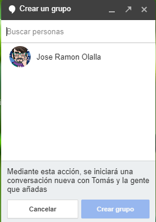

## Unidad 2\. Chatear {#unidad-2-chatear}

Las vídeollamadas serán objeto de otros de los módulos de este curso, así que nos centraremos aquí en los Chat de texto y, especialmente, los de voz.

Continuando con las recomendaciones anteriores sobre correo, hemos reservado la undécima para esta segunda unidad: Activa el chat si tienes Gmail. Estar comunicado con tu equipo docente o con las familias a la vez que respondes sus correos puede resultarte muy útil estos días.

Las llamadas de voz o videollamadas ayudarán a que entiendan mejor tus explicaciones.

### 2.1\. Mensajería instantánea y masiva. Contenido opcional {#2-1-mensajer-a-instant-nea-y-masiva-contenido-opcional}

Hoy más que nunca es necesario un servicio de mensajería instantánea para comunicar con el equipo docente o con las familias. Seguro que en el centro hay un grupo de Whatsapp para profesorado, así que no insistiremos en ello, pero el grupo o los grupos de mensajería con las familias es un asunto más delicado. Por eso, proponemos Telegram, ya que es un servicio similar a Whatsapp, pero permite ocultar el número de teléfono de las personas que participan.

[Obtén más información sobre Telegram y sus configuraciones a través de este manual.](https://www.google.com/url?q=http://wp.catedu.es/cmeducativo/telegram-para-redes-internas/&sa=D&ust=1584707445701000)

#### Evaluación (opcional) {#evaluaci-n-opcional}

### 2.2\. Remind. Una aplicación para trabajar con nuestro alumnado {#2-2-remind-una-aplicaci-n-para-trabajar-con-nuestro-alumnado}

[Remind](https://www.google.com/url?q=https://www.remind.com/&sa=D&ust=1584707445702000) es una herramienta de comunicación que ha sido diseñada para su uso en ambientes educativos, por lo que permite mantener el contacto con nuestro alumnado de una forma fácil, segura y directa. La aplicación es multiplataforma, desde su versión web, hasta sus versiones para escritorio (Windows o IOS) y su versión móvil (Android / IOS). Su integración con Classroom y otras herramientas amplían mucho sus posibilidades y usabilidad. La aplicación es gratuita, pero tiene unos límites. Podemos crear hasta 10 clases y en cada clase puede haber hasta 150 miembros. Si necesitamos más clases, sería necesario contratar un paquete de pago para el centro. Antes de explicar su operatividad, conveniente explicar en 6 puntos la utilidad de Remind.

#### 2.2.1\. 6 Razones para utilizar Remind en Clase {#2-2-1-6-razones-para-utilizar-remind-en-clase}

*   **Aplicación Multiplataforma y gratuita**: Es una aplicación multiplataforma, que se puede utilizar y gestionar desde dispositivos móviles (Smarphone y tablet) y desde su versió web y de escritorio. Además, como ya viene siendo habitual en este tipo de herramientas, se ejecuta en los principales sistemas operativos móviles (android, IOS). ¡Ah! y lo mejor de todo es que es una aplicación totalmente gratuita y sin publicidad. En estos tiempos, eso se agradece.

*   **Privacidad**: Esta aplicación nos permite mantener una férrea privacidad. No es necesario intercambiar ni direcciones de correo electrónico ni números de teléfonos para mantener una comunicación con nuestro alumnado. Lo único que tenéis que hacer es crear una cuenta en la plataforma como profesores. Posteriormente, una vez cumplimentado los datos (podéis acceder con vuestra cuenta de Google o Facebook fácilmente), podréis generar una clase e invitar a vuestros alumnos y alumnas con el código que se genera. El aspecto positivo es que ni los alumnos verán datos personales del profesor ni nosotros accedemos a sus datos de correo ni de teléfono, por lo que es perfecto para mantener la privacidad de los agentes implicados en esta comunicación. Ese código podéis compartirlo los primeros días de clase del curso bien a través de un documento, o simplemente copiándolo en la pizarra para que lo copien en la libreta. En su defecto, lo podéis enviar por correo electrónico u otros medios.

*   **Comunicación con los padres**. La herramienta facilita que los padres puedan ingresar en la clase y vean la comunicación del profesor con los alumnos y alumnas. La comunicación se puede desarrollar de diversa forma. Lo mejor es limitar la interacción entre el alumnado, y dejar que la comunicación se produzca únicamente de forma bidireccional, entre el profesor y el alumnado.
 

Este es un aspecto positivo ya que impide que la aplicación se convierta en un escenario para hablar de cualquier tema. No es una aplicación para debatir, sirve para comunicarnos con el alumnado, mandar tareas, resolver dudas, etc. y poder resolver dudas de los padres o concertar tutorías con ellos, o alertarlos de cualquier problema que pudiera surgir de una forma rápida.

*   **Envío de archivos adjuntos**: La aplicación permite enviar archivos adjuntos (pdf´s, documentos word, imágenes, etc) bien desde nuestro dispositivo (movil, tablet, ordenador), como desde Google Drive u otros servicios compatibles con la aplicación. Asimiso, también podemos enviarles tareas desde google Classroom si enlazamos nuestra cuenta de Remind con Classroom de Google. De esta forma podemos enviar tareas concretas por este canal de comunicación, bases de proyectos y un sin fin de archivos relacionados con la educación de nuestros alumnos. Asimismo, como es obvio, también podemos enviar enlaces a recursos que nos parecen interesantes que conozcan o a nuestro blog de aula si lo tenemos. Las posibilidades son muchas.

*   **El horario**. Un aspecto importante, debemos crear un horario para que nuestro alumnado se comunique con nosotros. La aplicación nos permite establecer qué horas al día o qué día de la semana y a qué horas podremos estar conectados. De tal forma que fuera de los horarios de clase podamos atender a algunas preguntas que puedan plantearnos días previos a exámenes o de entrega de trabajos. En clase hay que concienciar al alumnado del buen uso de la aplicación.

*   **Avisos**: Gracias a Remind podemos enviar un aviso al alumnado de una clase al mismo tiempo y de una misma vez, sin tener que escribir 25 mensajes, o podemos enviar ese mismo mensaje a varias clases de un mismo nivel, o a todas las clases que tengamos. Esta opción puede ahorrarnos mucho tiempo en la comunicación. Esta opción es especialmente útil cuando se acerca una fecha señalada e importante, como la fecha de un examen o de entrega de un trabajo y queremos recordarlo a los alumnos y alumnas.

#### 2.2.2\. Remind: una experiencia en el aula. {#2-2-2-remind-una-experiencia-en-el-aula}

La experiencia con Remind puede llegar a ser muy positiva. Pero antes de empezar a utilizarla, hay que explicar al alumnado por qué utilizamos esta herramienta, qué objetivos se persigue, y su utilidad. 

Para ello hay que dedicarle unos 10 minutos a explicar la app y su usabilidad. Una vez hecho eso, es necesario hacerles llegar el código de la clase, o clases, a las que se tiene que apuntar. Para ordenar las clases, lo mejor es poner primero el curso y luego la asignatura (2º ESO. Ciencias Sociales).

**¿Para qué se puede utilizar Remind?** Aquí os dejamos algunas ideas:

*   Recordar y comunicar fechas de exámenes y de entrega de trabajos.

*   Enviar las bases de proyectos o situaciones de aprendizaje.

*   Enviar actualizaciones del blog de aula. Cada unidad nueva que se cuelga en nuestro blog se comparte por Remind para que todos los alumnos y alumnas accedan directamente a ese material (resumen del tema, presentaciones, actividades, etcétera).

*   Enviar actividades diseñadas mediante otras plataformas, como Classroom.

*   Comunicar cualquier alteración en nuestro horario (si un día faltA, por ejemplo, se lo comunico y les digo qué hacer.

*   La comunicación no tiene por qué ser s diaria, sino que se debe limitar a un mensaje o dos a la semana a lo sumo. La idea es comunicar realmente lo imprescindible a importante, pues en el aula se mantiene viva esa comunicación. 
El alumnado, por otra parte, suele ser muy cauteloso a la hora de escribir y si lo hace es porque tienen dudas importantes sobre los trabajos o exámenes, con lo que la comunicación que se mantiene es realmente rica y positiva para ellos, pues se pueden enviar explicaciones sobre cuestiones concretas así como enlaces a recursos audiovisuales o escritos que les ayude a comprender aspectos que quizá no les queda claro. 
Asimismo, si van a faltar a clase el día del examen por cuestiones justificadas, suelen comunicármelo por esta vía y tratamos de poner otra fecha para no perder tiempo y que el alumno o alumna pueda estudiar con garantías.

*   En la situación actual, esta herramienta puede ser un buen canal para que el alumnado pregunta sus dudas sobre nuestras asignaturas. Eso sí, hay que establecer que sólo pueden escribirnos en el horario establecido.

Remind cumple con lo que promete en su web, y no tiene más pretensiones que convertirse en **una aplicación útil y sencilla para conectar profesores, alumnos y padres**. 

Desde luego, es una herramienta básica pero muy útil y depende de cómo enfoques tus clases. Para cuestiones más complejas, para eso tenemos Classroom o Edmodo.

Para acabar, compartimos una presentación en la se explica todo el proceso de registro y uso de esta aplicación. Deberéis consultarlo para aprender a utilizar Remind.

<iframe src="https://docs.google.com/presentation/d/e/2PACX-1vR5bSVP0o79jCQHag8-vLwIUENkY3xH1d-ueTn6SgYvo92wZLhVSGrWA7gO1q_cY5f_WuuutvOZNyjj/embed?start=false&loop=false&delayms=3000" frameborder="0" width="1365" height="1053" allowfullscreen="true" mozallowfullscreen="true" webkitallowfullscreen="true"></iframe>

### 2.3\. Discord: Chat de voz {#2-3-discord-chat-de-voz}

La existencia de servicios de videollamada, ha relegado a los chat de voz a un segundo plano, sin embargo, adquieren sentido si el vídeo de los interlocutores pierde protagonismo en favor de mostrar entornos de trabajo, como puede ser una pizarra para explicar o colaborar.

En este sentido, puedes ver este vídeo de uso de la pizarra Jamboard de Google.
<iframe width="560" height="315" src="https://www.youtube.com/embed/db17RMZdXDQ" frameborder="0" allow="accelerometer; autoplay; encrypted-media; gyroscope; picture-in-picture" allowfullscreen></iframe>

Un buen acompañamiento para una sesión de Jamboard puede ser un chat de voz como el que proporciona [Discord](https://www.google.com/url?q=https://discordapp.com/&sa=D&ust=1584707445706000), que tiene versión on-line, de escritorio o[ app para dispositivos móviles](https://www.google.com/url?q=https://play.google.com/store/apps/details?id%3Dcom.discord%26hl%3Des_419&sa=D&ust=1584707445706000). En el ejemplo que nos ocupa, lanzaríamos y compartiríamos el enlace a la Jamboard y el enlace al chat de discord.

Una vez que nos hemos dado de alta, podemos nuestro canal e invitar a la participación mediante URL.

Se trata de un programa con muchas más prestaciones interesantes, pues permite crear categorías e, incluso, compartir archivos o mostrar el escritorio con sus aplicaciones,, pero eso ya sería objeto de una formación más larga.

También tiene versión para [descargar](https://www.google.com/url?q=https://discordapp.com/download&sa=D&ust=1584707445707000) en  WIndows, Linux, Mac e IOS.

