## Unidad 2: Trello {#unidad-2-trello}

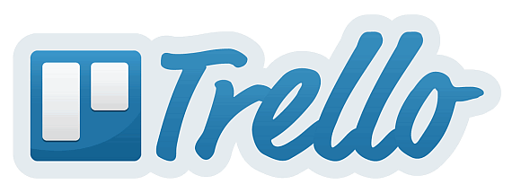

### Capítulo 0: ¿Qué es Trello? {#cap-tulo-0-qu-es-trello}

Es una herramienta colaborativa para trabajar en equipo y gestionar las tareas que forman parte de un proyecto mediante un sistema de tarjetas intercambiables entre distintas columnas de un tablero que puede sernos muy útil estos días en los que la organización de un equipo disperso cobra una gran importancia.

Para poder usarlo, tendremos que registrarnos en su página [https://trello.com/es](https://www.google.com/url?q=https://trello.com/es&sa=D&ust=1584707445730000) y acceder al escritorio en el que encontramos tres zonas significativas:

1.  Zona de tableros, para acceder a los existentes o crear uno nuevo.
2.  Menú principal, para acceder a la zona de tableros o crear equipos.
3.  Perfil, notificaciones…

### Capítulo 1\. Crear un equipo {#cap-tulo-1-crear-un-equipo}

Aunque no es imprescindible para trabajar con trello, en centros grandes, podemos crear equipos de trabajo si nuestra intención es asignar tareas no a personas sino a grupos o conformar equipos que puedan crear sus propios tableros. En este caso, definir los equipos sería un paso previo y servirían para cualquier tablero de forma que, a medida que vayamos creando tareas, podamos irlas asignando a equipos.

Es necesario completar todos los campos para que se active continuar.

Como veremos más abajo, a la vez o posteriormente, podemos invitar a personas a un tablero, a un equipo o a ambas funciones.
 
 {#-0}

### Capítulo 2. Crear un tableros, listas y tarjetas {#cap-tulo-2-crear-un-tableros-listas-y-tarjetas}

#### Tableros {#tableros}

Nada más fácil que crear un tablero con Trello, desde **Crear tablero nuevo** (1) añadimos un título, seleccionamos un equipo (no es necesario), decidimos su privacidad y elegimos el aspecto.

La privacidad dependerá de si es un tablero sin equipo (público o privado) o con equipo:

Este es el aspecto que ofrece nuestro tablero una vez creado:

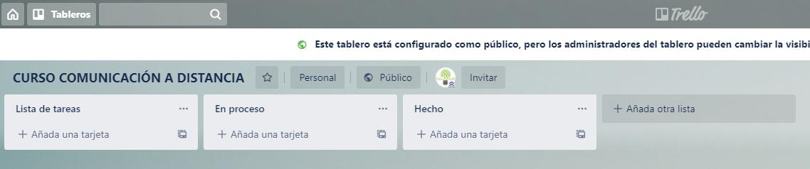

En él aparecen varias columnas, que son listas de tareas y cuyos nombres se pueden cambiar con hacer clic sobre la denominación actual y, en cada una de las listas, la posibilidad de añadir tarjetas. Para que una lista quede fijada, tenemos que pulsar en añadir lista.

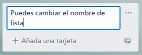

#### Tarjetas {#tarjetas}

Las tarjetas son las tareas o partes de una lista y para crearlas sólo hay que pulsar +Añadir una tarjeta. En el momento de su creación, ya podemos establecer las primeras configuraciones desde la línea de puntos (1) que aparece al lado de crear tarjeta.

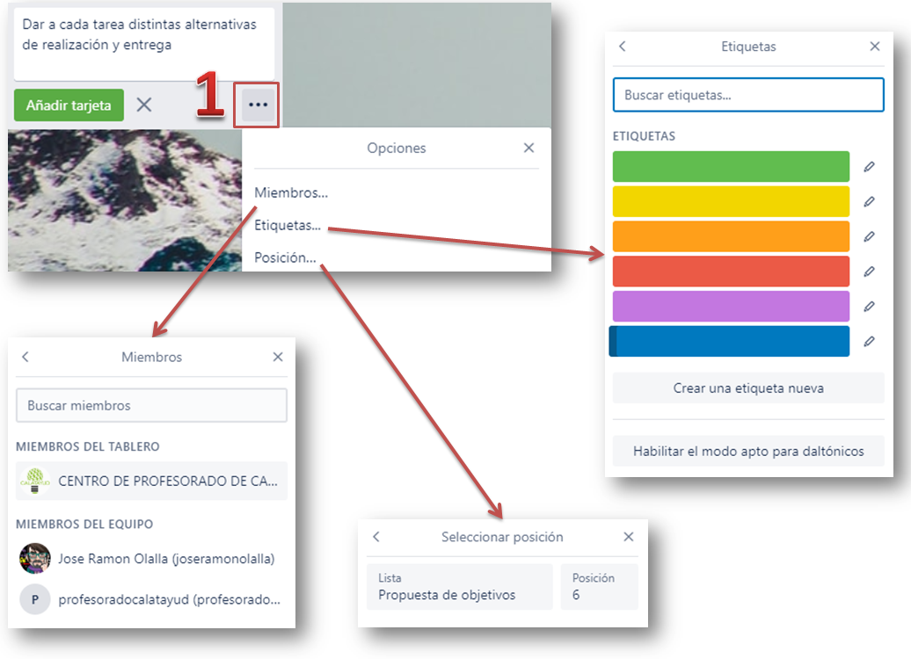

Es posible asignarla a un grupo o a algún miembro del grupo si los hemos creado previamente.

Podemos asignar un color a la tarjeta para una mejor identificación visual por temas o seleccionar una posición, aunque esta función no es muy útil pues las tarjetas pueden reordenarse dentro de una columna o moverse a otra.

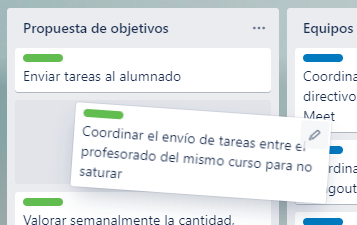

Este es el aspecto que podría presentar nuestro tablero una vez creado y que puedes ver mediante [el enlace](https://www.google.com/url?q=https://trello.com/b/uJ2OL23f/curso-comunicaci%25C3%25B3n-a-distancia&sa=D&ust=1584707445736000):

Independientemente de la edición que puede hacerse al crear una tarjeta, cada una de ellas tiene una herramienta de edición que puede activarse al pasar el cursor por ella.

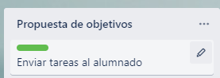

Al pulsar, además de editar el texto, aparece un menú emergente que nos permitirá:

*   **Editar** las tarjetas: modificar el texto y cambiar el color o añadir colores nuevos, pues una misma tarjeta puede tener varios colores.

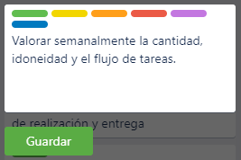

*   **Cambiar o añadir miembros**, en cuyo caso aparecerán reseñados en la tarjeta, junto con un ojo que indica si la persona identificada en el tablero sigue esa tarjeta.

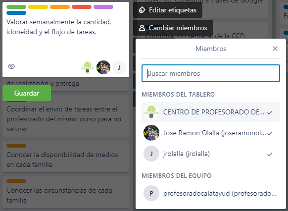

*   **Mover**, que no es muy relevante pues puede hacerse arrastrando con el ratón y, sobre todo Copiar, pues permite que una tarjeta pueda estar en más de una lista a la vez.
*   **Añadir (o cambiar) una fecha de vencimiento**, en el caso de que sea necesario tener lista la tarea para un momento dado.
*   **Archivar la tarjeta** (cuidado, no pide confirmación).

Pero todavía pueden configurarse más elementos de las tarjetas si hacemos clic sobre cualquiera de ellas, aunque algunas de estas funciones están repetidas, hay otras nuevas que se describen a continuación:

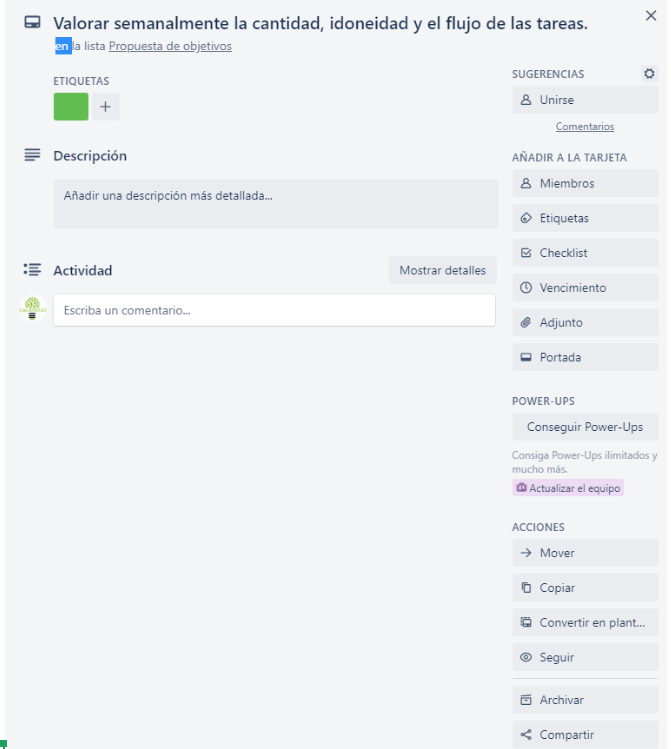

*   Unirse, a una tarea en concreto, con lo que el usuario se convierte en seguidor de esa tarea (icono ojo).
*   Ckecklist, que permite asignar a cada tarjeta una lista de cometidos a desarrollar y que aparecerán marcadas con un ✅ en las que tengan lista de control.
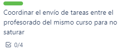

Cada usuario puede ir marcando los cometidos cumplidos.

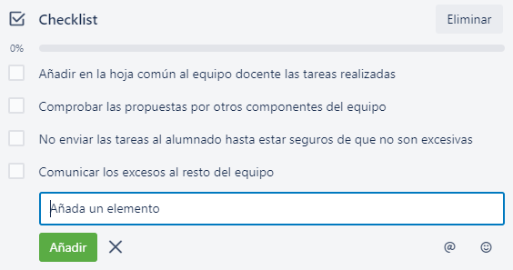
*   Adjuntos desde el ordenador, el propio trello (cada tarjeta tiene su propio vínculo), desde Google Drive, Box, Dropbox o One Drive. Si en una tarjeta aparece un clip, indicará que tiene archivos adjunto.

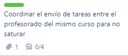
*   PowerUps: están limitados a 4 (y tres vienen por defecto), así que es preciso elegir muy bien el cuarto, en mi caso Google Drive, y aunque se configura desde una tarjeta, afecta a todo el tablero y aparece en la parte superior derecha.

*   Portada: cada tarjeta puede mostrar una imagen de la galería o subida desde nuestro equipo:

*   Cualquier tarjeta puede compartirse mediante enlace, interna o externamente, embeberse o ser comentadas por correo electrónico (propio de cada tarjeta).
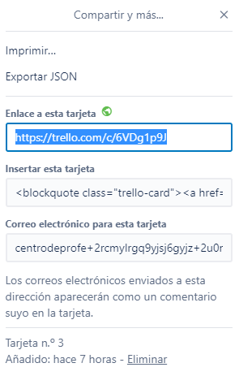
*   Finalmente, en la zona central, aparecen la edición de una descripción más detallada que complete al enunciado de la tarjeta
*   Los comentarios, que permiten interactuar con una tarjeta mediante texto escrito, archivo adjunto, emoticono, otra tarjeta de trello...

Las tarjetas muestran todos los elementos añadidos que tienen, en este caso, por ejemplo tiene seguimiento, un comentario, un adjunto y una checklist de cuatro elementos.

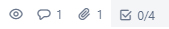

Si, aprovechando una tarjeta, creamos una plantilla, se incorpora un icono a cada lista para crear tarjeta directamente o desde plantilla.

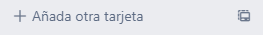

### Capítulo 3. Visibilidad {#cap-tulo-3-visibilidad}

Desde el menú superior se puede configurar la visibilidad y mientras que en el menú lateral derecho se configuran las acciones que realizan los distintos perfiles

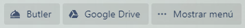

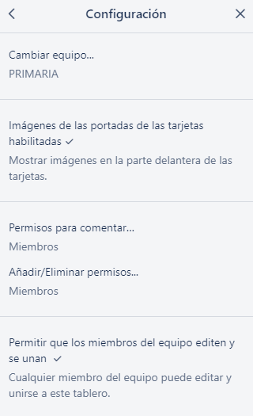

El equipo, equipos o sin equipo

Quién comenta:

*   Deshabilitado
*   Miembros
*   Miembros y observadores
*   Miembros del equipo
*   Cualquier usuario de Trello

Quién gestiona los permisos:

*   Administradores
*   Todos los miembros

Quién puede editar y unirse

### Capítulo 4. El menú principal {#cap-tulo-4-el-men-principal}

El menú principal tiene varias capas.

#### Configuración general
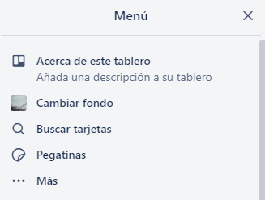

Además de las opciones que resultan obvias, las pegatinas son stikers que pueden introducirse dentro de las tarjetas (para quitarlas basta con posicionarse sobre ellas y esperar a que salga Quitar.

#### Más configuraciones

 

En ...Más la configuración nos lleva a (como elementos más relevantes):

*   lo visto anteriormente en visibilidad
*   elementos archivados para recuperarlos o eliminarlos.
*   configuración del correo electrónico del tablero (para poder enviar comentarios por email)
*   seguimiento del tablero completo (notificaciones)
*   copiar para duplicar el tablero
*   impresión del tablero en columna continua (las opciones de exportación son premium
*   URL, en nuestro caso: [https://trello.com/b/uJ2OL23f](https://www.google.com/url?q=https://trello.com/b/uJ2OL23f&sa=D&ust=1584707445750000)

La parte inferior del menú principal muestra la actividad en orden cronológico inverso.

### Capítulo 5. Notas finales {#cap-tulo-5-notas-finales}

#### Butler {#butler}

Todavía se le puede sacar más rendimiento a Trello usando **Butler**, creando comandos de macro a través de **Rules**, botones para realizar tareas habituales (enviar al revisor, asignarme…) mediante **Card Button, o Borad Button** para crear botones comunes a todo el tablero (normalmente tareas de mantenimiento como archivar todos los viernes las tareas de la semana en una lista creada ad hoc…) y otras que están limitadas por la versión gratuita. Sin embargo no las incluimos en este curso dado que excede de su duración y de su funcionamiento básico. Tiempo habrá de investigarlas cuando pasen las premuras que nos ocupan.

#### Participantes en los tableros 

El acceso por invitación para participar (que no para observar) tiene dos fases: la invitación.
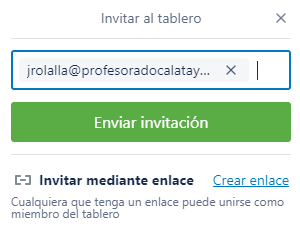

La aceptación de la invitación recibida por correo electrónico.

También es posible **invitar mediante enlace** enviando nosotros mismos el correo. Esta opción es interesante cuando algún miembro invitado por el método anterior tiene problemas de acceso al reconocer su dirección de correo como registrado sin aceptar.

La situación ideal es que el personal al que vayamos a invitar esté registrado previamente en Trello, así que si lo vamos a usar en nuestro centro, es preferible que el profesorado se registre antes de compartir nuestros tableros.

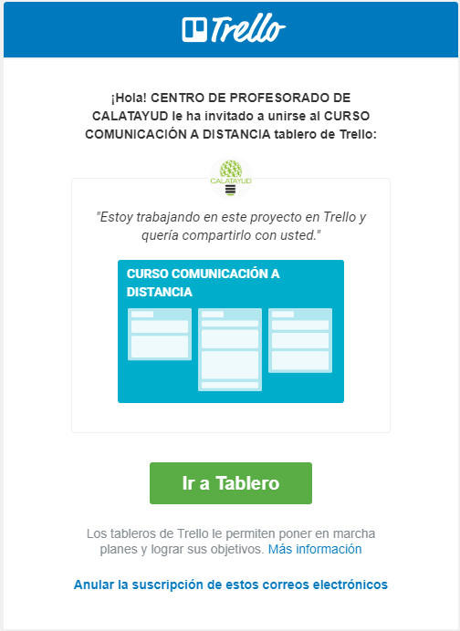